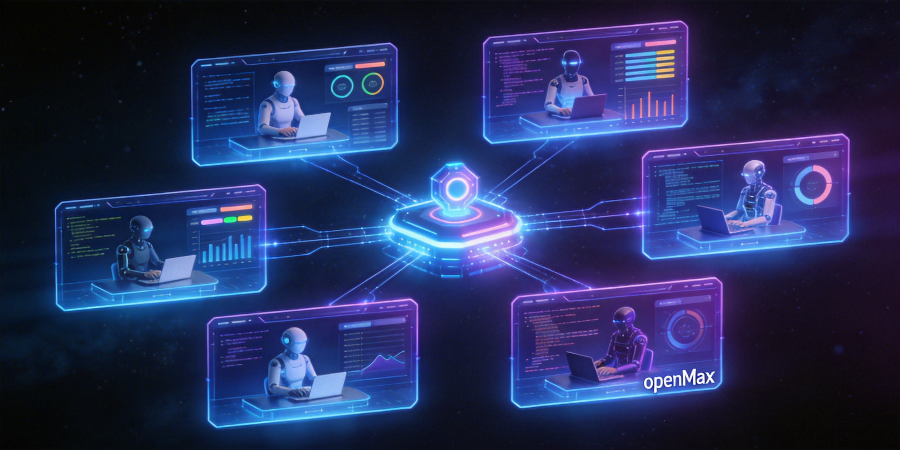

<p align="center">
  
</p>

<h1 align="center">openMax</h1>

<p align="center">
  <strong>Multi AI Agent orchestration hub</strong>
</p>

<p align="center">
  <a href="https://pypi.org/project/openmax/"></a>
  <a href="https://opensource.org/licenses/MIT"></a>
  <a href="https://www.python.org/downloads/"></a>
</p>

---

One command, multiple AI agents, one window.

openMax breaks down your task, dispatches agents (Claude Code, Codex, OpenCode) into [Kaku](https://github.com/niceda/kaku) terminal panes, monitors progress, and intervenes when needed.

```
openmax run "Build a blog with Next.js"
         │
         ▼
┌──────────────────────────────────┐
│  Lead Agent                      │
│  Align → Plan → Dispatch →       │
│  Monitor → Report                │
└──────────┬───────────────────────┘
           ▼
   ┌────────────────────────────────┐
   │  ┌────────────┬─────────────┐  │
   │  │ claude-code │ codex       │  │
   │  │ components  │ API routes  │  │
   │  ├────────────┼─────────────┤  │
   │  │ claude-code │ opencode    │  │
   │  │ tests       │ styling     │  │
   │  └────────────┴─────────────┘  │
   └────────────────────────────────┘
```

## Install

```bash
pip install openmax
```

**Requirements:**
- macOS (Kaku is macOS-only)
- Python 3.10+
- [Kaku](https://github.com/niceda/kaku) terminal — auto-prompted via `brew install --cask kaku` if missing
- At least one agent CLI: [Claude Code](https://docs.anthropic.com/en/docs/claude-code) (`claude`), [Codex](https://github.com/openai/codex) (`codex`), or [OpenCode](https://github.com/opencode-ai/opencode) (`opencode`)

## Usage

```bash
openmax run "Build a blog with Next.js"
```

The lead agent (powered by [claude-agent-sdk](https://github.com/anthropics/claude-agent-sdk-python)) will:
1. **Align** — clarify your goal, identify scope
2. **Plan** — decompose into parallelizable sub-tasks
3. **Dispatch** — spawn agents into Kaku panes (one window, auto grid layout)
4. **Monitor** — read agent output, intervene if stuck or off-track
5. **Report** — summarize results when all tasks complete

### Options

```bash
openmax run "task" --cwd /path/to/project   # set working directory
openmax run "task" --model claude-sonnet-4-20250514  # lead agent model
openmax run "task" --max-turns 30            # limit lead agent turns
openmax run "task" --keep-panes              # keep panes open after exit
```

### Other commands

```bash
openmax panes              # list all Kaku panes
openmax read-pane <id>     # print a pane's terminal output
openmax --version          # show version
```

## Agents

| Type | Command | Example |
|------|---------|---------|
| `claude-code` | `claude` | Best for most coding tasks |
| `codex` | `codex` | OpenAI Codex CLI |
| `opencode` | `opencode` | OpenCode CLI |

All agents run interactively in their own pane. You can click into any pane and type to intervene at any time. The lead agent also monitors and sends corrections automatically.

## How it works

openMax uses a **lead agent** that has no direct access to files or code. Instead, it orchestrates through 6 tools:

- **dispatch_agent** — spawn an agent in a Kaku pane
- **read_pane_output** — check what an agent is doing
- **send_text_to_pane** — send follow-up instructions
- **list_managed_panes** — get pane states
- **mark_task_done** / **report_completion** — track progress

On exit (normal completion, Ctrl-C, or SIGTERM), all managed panes are killed automatically. Use `--keep-panes` to override.

## License

MIT
